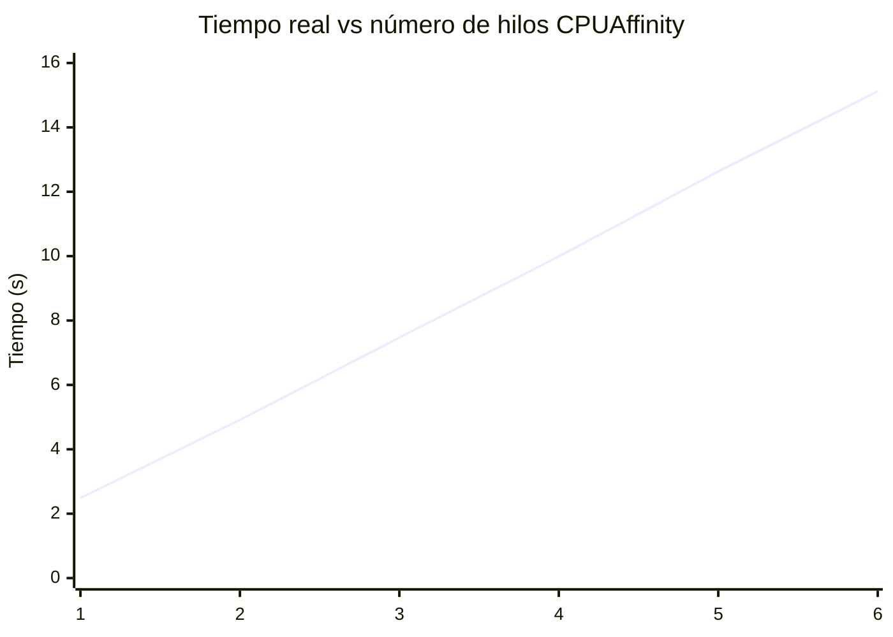
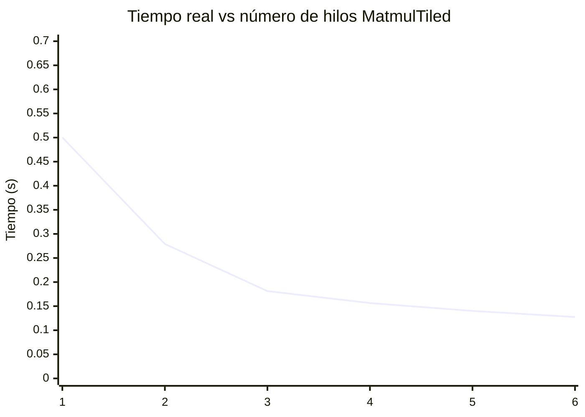
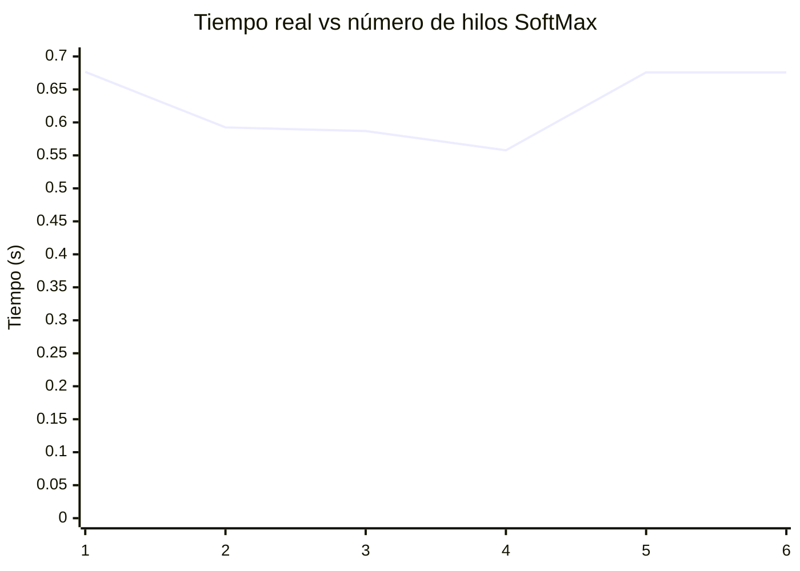

# Practica 3
## Parte A

## Parte B

# Practica 4
## Parte A, B: Tiempos de ejecución

| Versión         | Tiempo de llenado (us) | Tiempo de suma (us) |
|-----------------|------------------------|---------------------|
| bench-static    |         1574785.272    |   3820404.482       |
| bench-dynamic   |         2186325.432    |   5798714.192       |

Se observa que el bench statico tuvo un mejor performance las 2 categorias (menor tiempo de ejecución), esto es debido a que las bibliotecas estáticas son código que se "pega" directamente en el ejecutable, mientras que las bibliotecas dinámicas son accedidas mediantes saltos a otras direcciones de memoria donde se encuentra el ejecutable de la biblioteca, lo que causa el aumento en el tiempo de ejecución.

