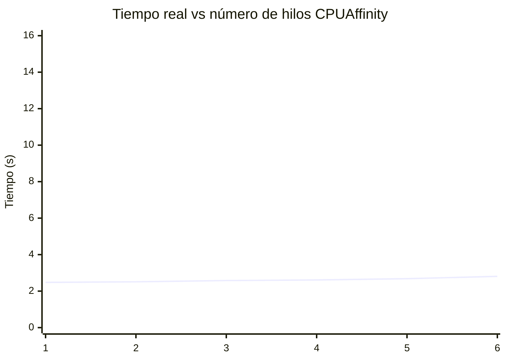
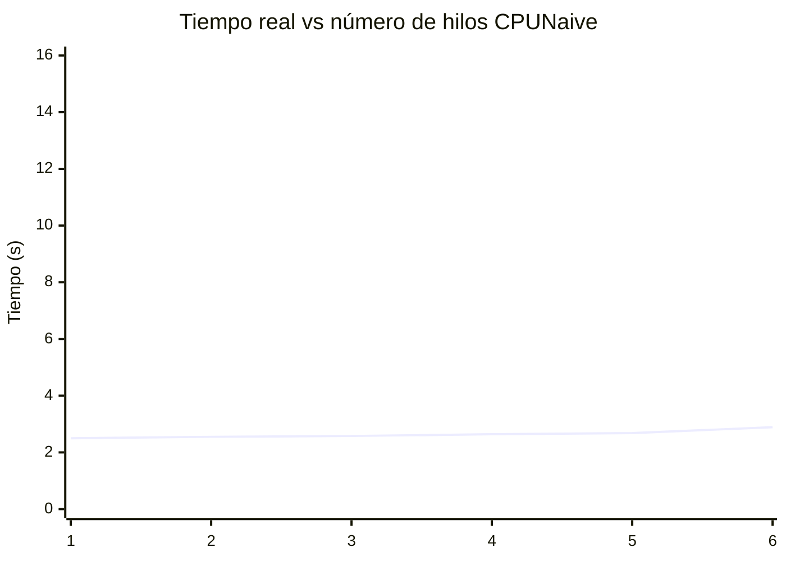
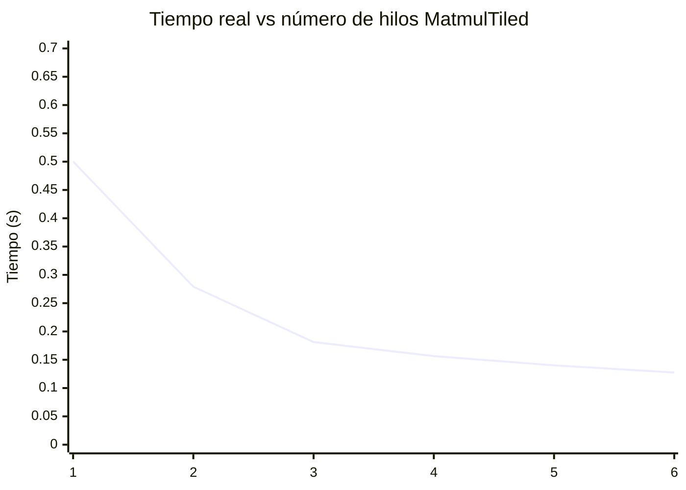
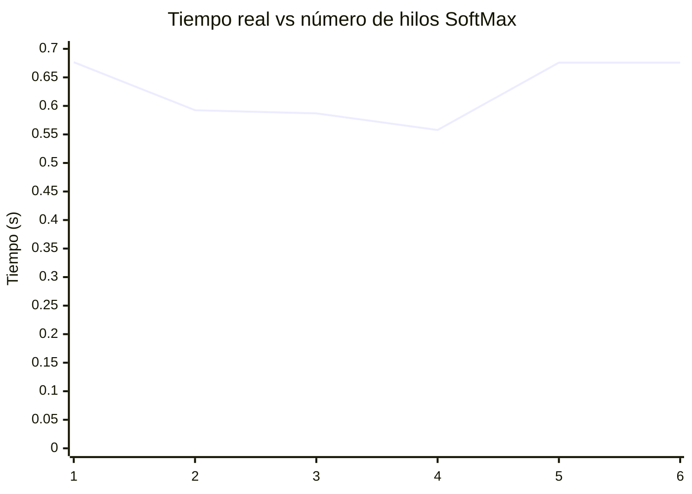

# Practica 3
## Specs del equipo
Specs:
Model name:                AMD Ryzen 5 4500U with Radeon Graphics
Architecture:                x86_64
  CPU op-mode(s):            32-bit, 64-bit
  Address sizes:             48 bits physical, 48 bits virtual
  Byte Order:                Little Endian
  Thread(s) per core:      1
   Core(s) per socket:      67

Caches (sum of all):         
  L1d:                       192 KiB (6 instances)
  L1i:                       192 KiB (6 instances)
  L2:                        3 MiB (6 instances)
  L3:                        8 MiB (2 instances)
NUMA:                        
  NUMA node(s):              1
NUMA node0 CPU(s):         0-5

RAM: 15GB
SWAPMemory: 4GB
CPU max MHz:             4000.0000
CPU min MHz:             1400.0000a

Set de instrucciones: se
sse2
ssse3
sse4_1
sse4_2
avx
sse4a
misalignsse
avx2

Sistema Operativo: Arch
Version del Kernel: 7.1.8-arch1-3
## Parte A

Una razon que podria explicar el comportamiento de ambos algoritmos se mantiene relativamente plano, es que el sistema operativo logra ejecutar cada hilo en su propio core fisico(solo 1 hilo por core para esta arquitectura). El leve incremento con más hilos se puede deber a la restriccion de recursos compartidos entre cores: por ejemplo la cache L3 y el ancho de banda de memoria por lo que cada core recibe menos recursos conforme se aumentan los hilos. Se observa tambien que cpu-naive es un poco más lento que cpu-affinity, esto se puede deber a que al no fijar afinidad, el scheduler de Linux, puede estar migrando el hilo de un core a otro durante su ejecución lo cual causa invalidaciones de cache y recargas que consumen más tiempo.

## Parte B

# Practica 4
## Parte A, B: Tiempos de ejecución

| Versión         | Tiempo de llenado (us) | Tiempo de suma (us) |
|-----------------|------------------------|---------------------|
| bench-static    |         1574785.272    |   3820404.482       |
| bench-dynamic   |         2186325.432    |   5798714.192       |

Se observa que el bench statico tuvo un mejor performance en las 2 categorias (menor tiempo de ejecución), esto es debido a que las bibliotecas estáticas son código que se "pega" directamente en el ejecutable, mientras que las bibliotecas dinámicas son accedidas mediante saltos a otras direcciones de memoria donde se encuentra el ejecutable de la biblioteca, lo que causa el aumento en el tiempo de ejecución.

